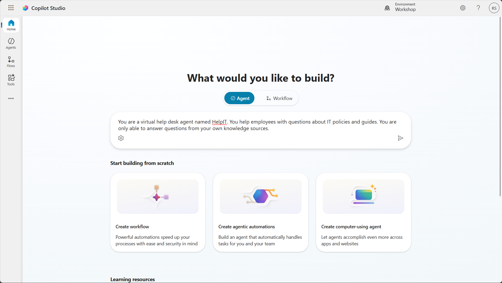
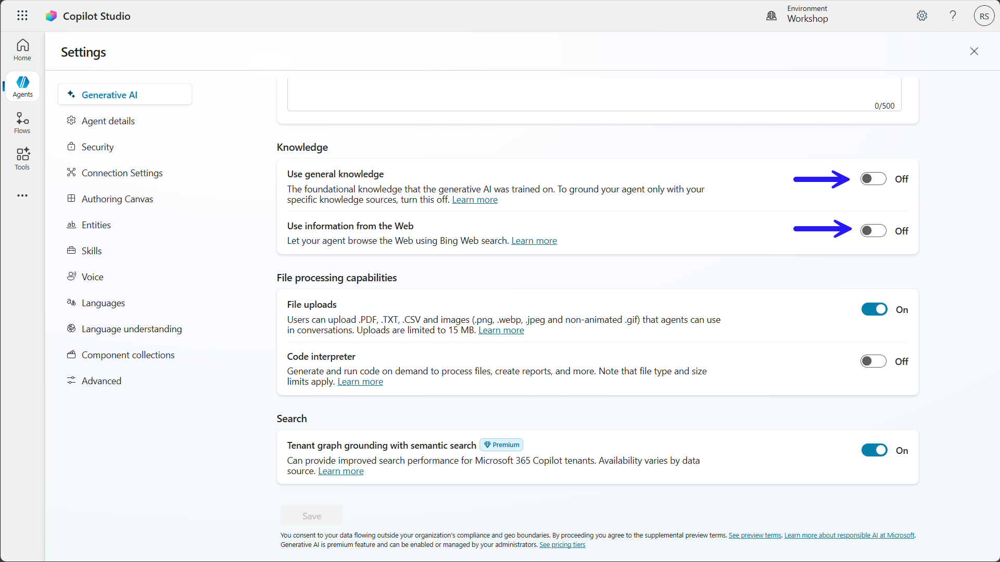
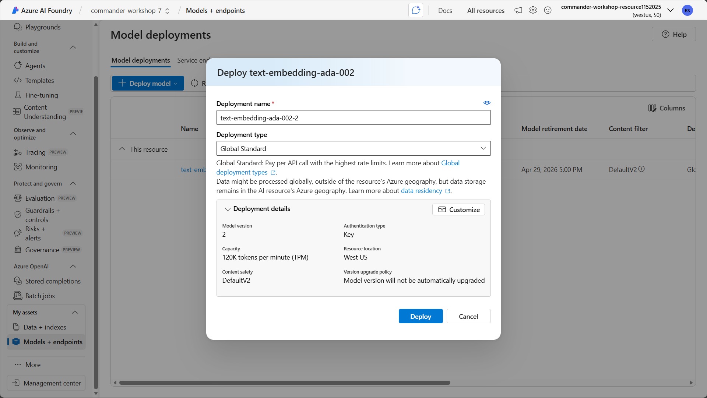
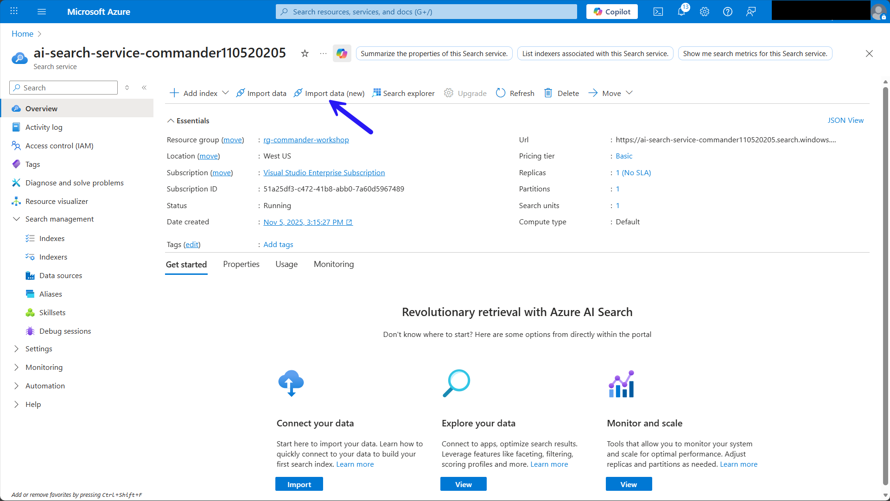
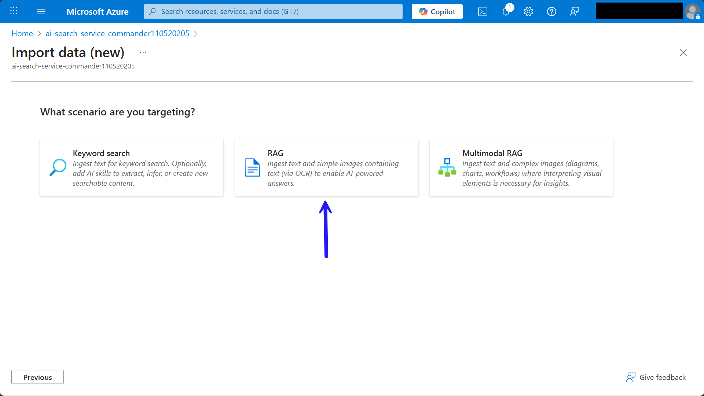
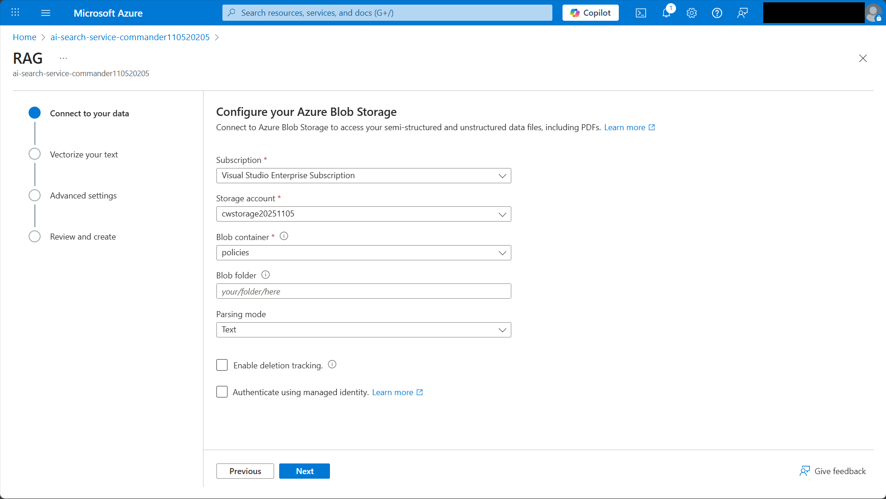
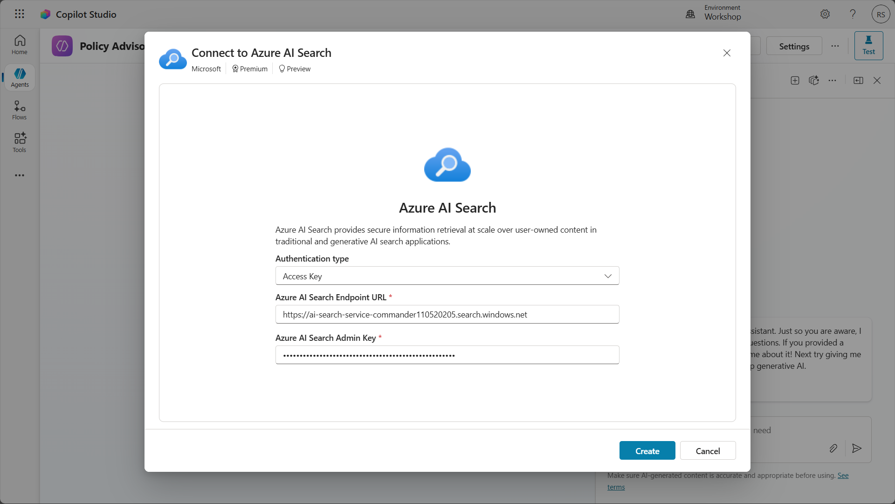
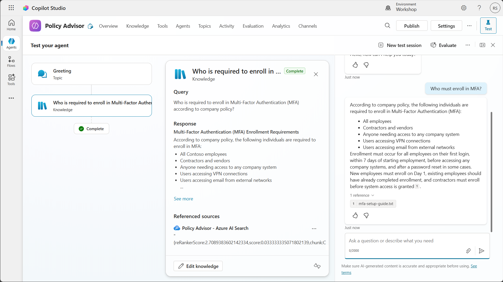

# 🚨 Mission 07: Extend agents with Azure AI

## 🕵️‍♂️ CODENAME: `OPERATION AZURE INTELLIGENCE`

> **⏱️ Operation Time Window:** `~60 minutes`  

## 🎯 Mission Brief

Your agent is powerful on its own, but connecting it to Azure AI unlocks enterprise-grade capabilities. This mission will teach you how to use Azure AI Foundry and Azure AI Search to create intelligent, custom experiences that go beyond out-of-the-box functionality.

By mission's end, you'll have deployed a custom AI model in Azure AI Foundry, integrated it into your agent through custom prompt actions, created a searchable knowledge base in Azure AI Search, and connected it all to your agent for expanded knowledge and capabilities.

## 🔎 Objectives

In this mission, you'll learn:

1. Understanding what Bring Your Own Model (BYOM) and Bring Your Own Data (BYOD) mean in the context of Microsoft Copilot Studio
1. Learning why and when to use BYOM and BYOD capabilities with your agents
1. Exploring how BYOM and BYOD integrate with Copilot Studio agents
1. Deploying AI models in Azure AI Foundry and connecting them via custom prompt actions
1. Creating searchable indexes in Azure AI Search and using them as knowledge sources

## 🤖 What does Bring Your Own Model mean?

Bring Your Own Model (BYOM) allows you to use custom or third-party AI models with your Copilot Studio agents instead of relying solely on the models built into Copilot Studio. This gives you flexibility to choose specialized models that best fit your specific use case. With BYOM, you can choose a model for your agent that meets your specific needs.

### What does BYOM enable?

- **Custom AI capabilities** - use specialized models trained for specific domains like legal, medical, or financial services.
- **Model flexibility** - select from various model providers including Azure OpenAI, open-source models, or your own fine-tuned models.
- **Control and compliance** - maintain control over model selection, deployment location, and data handling to meet regulatory requirements.
- **Cost optimization** - choose models that balance performance with cost based on your workload requirements.

### Types of models you can bring

- **Azure OpenAI models** - GPT-4, GPT-3.5, and other models deployed in your Azure subscription.
- **Azure AI model catalog** - access 1900+ models from the extensive Azure AI Foundry model catalog.
- **Custom fine-tuned models** - models you've trained or fine-tuned on your specific data.
- **Open-source models** - popular models like Llama, Mistral, or Phi deployed in Azure.

## 📊 What does Bring Your Own Data mean?

Bring Your Own Data (BYOD) enables you to connect your own enterprise data sources to your Copilot Studio agents, allowing them to provide grounded, accurate responses based on your organization's information.

### What does BYOD enable?

- **Enterprise knowledge** - ground your agent's responses in your organization's documents, databases, and systems.
- **Accurate information** - reduce hallucinations by connecting to authoritative data sources.
- **Real-time data** - access current information from your systems rather than relying on pre-trained knowledge.
- **Contextual responses** - provide answers that are relevant to your organization's specific context and terminology.

### Types of data sources you can bring

- **Azure AI Search** - searchable indexes of documents, websites, and structured data.
- **SharePoint** - documents and files stored in SharePoint sites.
- **OneDrive** - files stored in OneDrive for Business.
- **Dataverse** - structured data from your Power Platform environment.
- **Custom connectors** - any data source accessible via API.

## 🎯 Why use BYOM and BYOD in Microsoft Copilot Studio agents?

While Copilot Studio provides powerful out-of-the-box capabilities, BYOM and BYOD unlock advanced scenarios that make your agents truly enterprise-ready.

### Reasons to use BYOM

1. **Specialized expertise**
    - Use domain-specific models that understand industry terminology and context better than general-purpose models.
    - Example: a medical terminology model for healthcare agents.

1. **Performance optimization**
    - Select smaller, faster models for simple tasks and larger models for complex reasoning.
    - Balance response time with capability requirements.

1. **Compliance and governance**
    - Deploy models in specific Azure regions to meet data residency requirements.
    - Maintain full control over model versions and updates.

1. **Cost management**
    - Use cost-effective models for high-volume, low-complexity interactions.
    - Reserve premium models for complex scenarios.

1. **Custom capabilities**
    - Leverage models fine-tuned on your organization's data and use cases.
    - Implement specialized capabilities not available in standard models.

### Reasons to use BYOD

1. **Accuracy and reliability**
    - Ground responses in authoritative enterprise data rather than general knowledge.
    - Reduce the risk of hallucinations and incorrect information.

1. **Current information**
    - Access real-time data from your systems.
    - Ensure users receive up-to-date information.

1. **Enterprise context**
    - Provide responses that understand your organization's terminology, processes, and policies.
    - Reference internal documents, guidelines, and knowledge bases.

1. **Compliance**
    - Keep sensitive data within your environment rather than sending it to external services.
    - Maintain audit trails of data access.

1. **Personalization**
    - Tailor responses based on user roles, departments, or permissions.
    - Surface relevant information from the right data sources.

## ⚙️ How BYOM and BYOD work in Microsoft Copilot Studio agents

Understanding how these capabilities integrate with your agent helps you design effective solutions.

### BYOM integration architecture

1. **Model deployment**
    - Deploy your chosen model in Azure AI Foundry.
    - Configure the model endpoint and authentication.

1. **Connection in Copilot Studio**
    - Create a custom prompt action or generative action.
    - Connect to your Azure AI Foundry model endpoint.
    - Configure input parameters and output handling.

1. **Agent invocation**
    - Your agent calls the custom action during conversation.
    - Passes user input and context to the model.
    - Receives and processes the model's response.

1. **Response handling**
    - Parse the model output.
    - Format and present results to the user.
    - Handle errors and fallback scenarios.

### BYOD integration architecture

1. **Data preparation**
    - Index your data in Azure AI Search.
    - Configure field mappings and search capabilities.
    - Set up semantic ranking for improved relevance.

1. **Knowledge source configuration**
    - Add Azure AI Search as a knowledge source in Copilot Studio.
    - Configure authentication and index selection.
    - Define how results should be presented.

1. **Query processing**
    - Agent receives user query.
    - Searches your indexed data for relevant information.
    - Ranks and retrieves top results.

1. **Response generation**
    - Agent uses retrieved data to generate grounded responses.
    - Provides citations and sources to users.
    - Handles cases where no relevant data is found.

### Integration patterns

**Pattern 1: Custom prompt actions with BYOM**

- Use custom prompt actions to call your deployed model.
- Pass specific instructions and user input to the model.
- Receive structured or unstructured responses.
- Best for: specialized processing, custom analysis, domain-specific tasks.

**Pattern 2: Generative actions with BYOM**

- Create actions that combine your model with dynamic inputs.
- Enable the agent to adapt behavior based on conversation context.
- Support multi-step reasoning and complex workflows.
- Best for: multi-turn conversations, complex decision-making, adaptive responses.

**Pattern 3: Knowledge sources with BYOD**

- Configure Azure AI Search as a knowledge source.
- Enable automatic searching during conversations.
- Provide cited, grounded responses to user queries.
- Best for: FAQ handling, document search, information retrieval.

**Pattern 4: Combined BYOM + BYOD**

- Use your custom model to process results from your data sources.
- Enhance retrieval with custom ranking or filtering logic.
- Generate personalized responses based on retrieved data.
- Best for: complex enterprise scenarios, personalized experiences, advanced analytics.

## 🔌 Key capabilities and considerations

### Model capabilities

- **Prompt engineering** - craft effective prompts that guide model behavior.
- **Context management** - pass relevant conversation history and context to the model.
- **Token optimization** - manage input and output token usage for cost efficiency.
- **Error handling** - implement robust error handling for model failures.

### Data capabilities

- **Semantic search** - leverage AI-powered search for better relevance.
- **Hybrid search** - combine keyword and semantic search for comprehensive results.
- **Filtering** - apply filters based on user permissions, departments, or categories.
- **Ranking** - use custom ranking profiles to surface the most relevant results.

### Security and governance

- **Authentication** - secure connections to Azure AI services using managed identities or API keys.
- **Data privacy** - ensure sensitive data remains within your environment.
- **Access control** - implement role-based access to models and data sources.
- **Monitoring** - track usage, performance, and costs across all integrations.

## 🎨 Best practices

1. **Start with use cases**
    - Identify specific scenarios where BYOM or BYOD adds value.
    - Don't over-engineer - use built-in capabilities when they're sufficient.

1. **Choose the right model**
    - Match model capabilities to your use case requirements.
    - Consider cost, latency, and performance trade-offs.

1. **Prepare your data**
    - Ensure data is well-structured and properly indexed.
    - Use semantic ranking for better search relevance.
    - Keep indexes updated with fresh content.

1. **Optimize prompts**
    - Test and refine prompts for your custom models.
    - Include clear instructions and examples.
    - Manage token usage efficiently.

1. **Handle failures gracefully**
    - Implement fallback logic when models or data sources are unavailable.
    - Provide helpful error messages to users.
    - Log issues for monitoring and troubleshooting.

1. **Monitor and optimize**
    - Track usage patterns and costs.
    - Optimize model selection and data retrieval strategies.
    - Continuously improve based on user feedback.

## 🧪Lab 7.1: Bring your own data from Azure to your agent

In this lab, you will create a Policy Advisor agent and use Azure AI Foundry and Azure AI Search to bring your own data from Azure to enhance the agent's knowledge and capabilities.

### Prerequisites to complete this mission

1. An active Azure subscription with permissions to create resources

1. Access to [Azure AI Foundry](https://ai.azure.com) through your Azure account

1. Sample documents from [IT policies](https://download-directory.github.io/?url=https://github.com/RobStand/agent-academy/tree/main/docs/commander/07-extend-with-azure-ai/assets/it-documentation&filename=commander_sampledata)

### 7.1.1 Create the Policy Advisor agent

1. Navigate to [Copilot Studio](https://copilotstudio.microsoft.com)
1. Enter this prompt in **What would you like to build?**:

    `You are a policy agent named "Policy Advisor". You help employees with questions about policies. You are only able to answer questions from your own knowledge sources.`
    

1. Select **Create** and wait for the agent to be created
1. Select **Settings**
1. Turn off `Use general knowledge` and `Use information from the web`
    

1. Select **Save**

### 7.1.2 Create an Azure AI Foundry resource

1. On the Azure portal home page, select `Azure AI Foundry` under **Azure services** or search for it in the **Search** box
1. Select **Create a resource**
    
1. Configure the AI Foundry resource:

    - **Subscription**: Choose the Azure subscription you want to use
    - **Resource group**: Select **Create new** and name it `rg-commander-workshop`
    - **Name**: Enter a unique name for the AI Foundry resource
    - **Region**: Choose the region closest to you
    - **Default project name**: Enter `commander-workshop-7`

    

1. Select **Next** to proceed through the options
1. Select **Create**

### 7.1.3 Deploy an embedding model

1. Navigate to [Azure AI Foundry](https://ai.foundry.com)
1. Under **My assets** in the left-hand navigation, select **Models + endpoints**
1. Select **Deploy model**, then select **Deploy base model**
    
1. Enter `text embedding` in the **Search** box
1. Select `text-embedding-ada-002`
1. Select **Confirm**
    
1. Select **Deploy**
    

### 7.1.3 Set up Azure Blob Storage

1. Navigate to the [Azure portal](https://portal.azure.com)
1. Search for **Storage accounts** and select it in the search results
1. Select **Create**
1. Configure the Storage Account resource:

    - **Subscription**: Choose the Azure subscription you want to use
    - **Resource group**: Select `rg-commander-workshop`
    - **Storage account name**: Enter a unique name for the storage account resource
    - **Region**: Choose the region you selected for your AI Foundry resource
    - **Preferred storage type**: Choose `Azure Blob Storage or Azure Data Lake Storage Gen 2`
    - **Primary workload**: Choose `Backup and archive`
    - **Performance**: Choose `Standard`

    

1. Select **Review + create**, then **Create**.
1. When Azure finishes deploying the storage account, select **Go to resource**
1. In the left navigation, expand **Containers** and select **Add container**
1. Enter `policies` in the **Name** field and select **Create**

    

1. In the new `policies` container, on the toolbar, select **Upload**
1. Select the IT policy documents you downloaded from GitHub
1. Select **Upload**
1. The policy documents will appear in the container

    

### 7.1.4 Create an AI Search service

1. On the Azure portal home page, select `AI Search` under **Azure services** or search for it

    

1. Configure the AI Search service:

    - **Subscription**: Choose the Azure subscription you want to use
    - **Resource group**: Select `rg-commander-workshop`
    - **Service name**: Enter a unique name for the service
    - **Region**: Choose the region you selected for your AI Foundry resource
    - **Pricing tier**: Select `Basic`

    

1. Select **Review + create**, then **Create**
1. When Azure finishes creating the service, select **Go to resource**

### 7.1.5 Import data into AI Search

1. In your AI Search service, select **Import data (new)** on the tool bar

    

1. Select **Azure Blob Storage**
    
1. Select **RAG**
    
1. Configure the connection to Azure Blob Storage:

    - **Subscription**: The Azure subscription you want to use
    - **Storage account**: Select the storage account you created in Lab 7.1
    - **Blob container**: Select `policies`
    - **Parsing mode**: Select `Text`

    

1. Select **Next**

1. Configure the text vectorization:

    - **Kind**: Select `Azure AI Foundry`
    - **Subscription**: Select the Azure subscription you want to use
    - **Azure AI Foundry/Hub project**: Select `commander-workshop-7`
    - **Model deployment**: Select `text-embedding-ada-002`
  
1. Tick the box to acknowledge that connecting to an AI Foundry project will incur additional costs to your account.
1. Select **Next**
1. Ensure **Enable semantic ranker** is ticked
1. Select **Next**
1. Select **Create**

    

### 7.1.6 Add Azure AI Search as knowledge source

Now you'll connect your AI Search index as a knowledge source for your agent.

1. Navigate to [Copilot Studio](https://copilotstudio.microsoft.com)
1. Open the `Policy Advisor` agent
1. Select the **Knowledge** tab in the navigation bar
1. Select **+ Add knowledge**
1. Select **Azure AI Search**
1. Select the dropdown under **Your connections** and select **Create new connection**

1. Configure the connection:

    - **Authentication type**: Access key
    - **Azure AI Search Endpoint URL**: Select the AI Search service endpoint URL from Azure portal
    - **Azure AI Search Admin Key**: Select the AI Search service admin key from Azure portal

    

1. Select **Create**. You'll see the index you create in AI Foundry automatically selected.

    Select **Add to agent**

    

1. Verify the AI Search knowledge source appears in the list of knowledge sources
    

1. Test the agent with these queries:

    ```text
    What do I do if I am locked out of my account?
    Who must enroll in MFA?
    What are my options for Mac hardware?
    ```

The agent will call the AI Search knowledge source, which will use semantic search to answer your questions.

    

## 🧪 Lab 7.3: BYOM from Azure AI Foundry to your agent

In this lab, you'll put BYOM into practice by deploying a model from AI Foundry and using it in your agent to summarize information from documents.

### 7.2.2 Deploy a model

1. Deploy Llama model in AI Foundry

### 7.2.3 Use the model in a prompt

1. In the navigation bar, select **Tools**. Select **+ Add a tool**.

    Select **+ New tool**, and then select **Prompt**.

1. Enter `IT policy prompt` for the name

1. In the **Model** dropdown, select **+** next to **Azure AI Foundry Models**

1. Select **Connect a new model** and enter the details:

    - **Model deployment name**: Enter `llama`
    - **Base model name**: Enter `llama`
    - **Azure model endpoint URL**: Enter the URI from your model details from Azure AI Foundry
    - **API Key**: Enter the API key from your model details in AI Foundry

    Select **Connect**

1. In the **Instructions** for the prompt, enter this prompt:

    ```text
    You summarize long documents into concise, easy to understand paragraphs.
    
    Task: 
    - Summarize Search Results 
    - Use plain English.
    - Answer the user’s question using ONLY the retrieved content. 
    - Aggregate and deduplicate information. 
    - Preserve factual accuracy. 
    - Don't include sources. Just provide a paragraph.
    - If information is missing, say so.
    ```

1. Add the input parameter
1. Save
1. Add to agent and configure

### 7.2.4 Create the summarization topic

1. Create a topic
1. Add Generative Answers node
1. Add Prompt node
1. Add Message node

### 7.2.5 Use the model in a prompt


1. Under `Employee Question`, type `/` and select **Text**. Enter these details:

    - **Input**: `EmployeeQuestion`
    - **Sample data**: `What is the PTO policy?`

    Select **Close**

    Select **Save**

    

1. Select **Add to agent**. The prompt is now ready to be used in your agent.

1. Test the prompt in the agent by asking a question:

    ```text
    How much PTO do I get after 5 years?
    What's the 401k match?
    Can I work remotely from Canada for 2 weeks?
    What's covered by the home office stipend?
    How many weeks of parental leave for non-birth parents?
    What holidays does Contoso observe?
    How do I request bereavement leave?
    What's the tuition reimbursement limit?
    ```

    The prompt will use the fine-tuned model to give specific answers.
    

## ✅ Mission Complete

Congratulations! 👏🏻 You've successfully extended your Copilot Studio agent with Azure AI capabilities using both BYOM and BYOD approaches.

You've learned how to:

- Deploy custom AI models in Azure AI Foundry
- Create custom prompt actions that leverage your deployed models
- Build searchable knowledge bases with Azure AI Search
- Connect enterprise data sources to your agent for grounded responses

These capabilities unlock powerful enterprise scenarios and allow you to create truly intelligent, context-aware agents that leverage your organization's data and specialized AI models.

## 📚 Tactical Resources

🔗 [Azure AI Foundry documentation](https://learn.microsoft.com/azure/ai-studio/?WT.mc_id=aiml-0000-cxa)

🔗 [Custom prompt actions in Copilot Studio](https://learn.microsoft.com/microsoft-copilot-studio/advanced-generative-actions?WT.mc_id=power-0000-cxa)

🔗 [Azure AI Search documentation](https://learn.microsoft.com/azure/search/?WT.mc_id=aiml-0000-cxa)

🔗 [Knowledge sources in Copilot Studio](https://learn.microsoft.com/microsoft-copilot-studio/knowledge-source-azure-ai-search?WT.mc_id=power-0000-cxa)

🔗 [Best practices for prompt engineering](https://learn.microsoft.com/azure/ai-services/openai/concepts/prompt-engineering?WT.mc_id=aiml-0000-cxa)

📺 [Bring Your Own AI Models to Copilot Studio](https://www.youtube.com/watch?v=example)

📺 [Grounding Copilot with Azure AI Search](https://www.youtube.com/watch?v=example)


