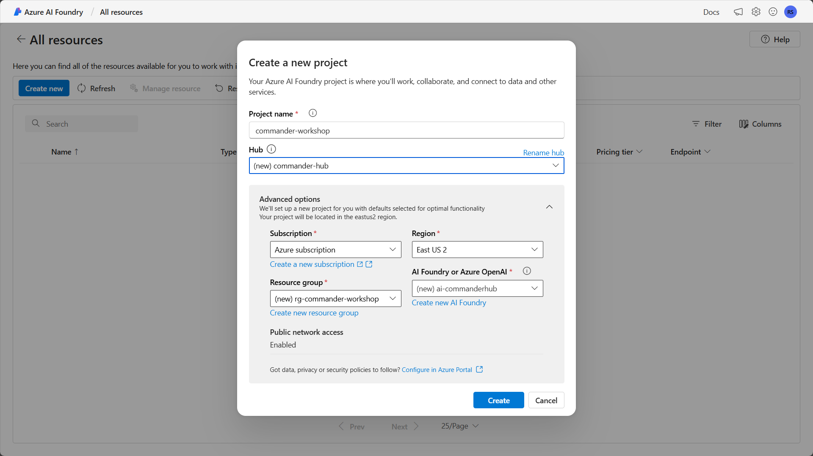
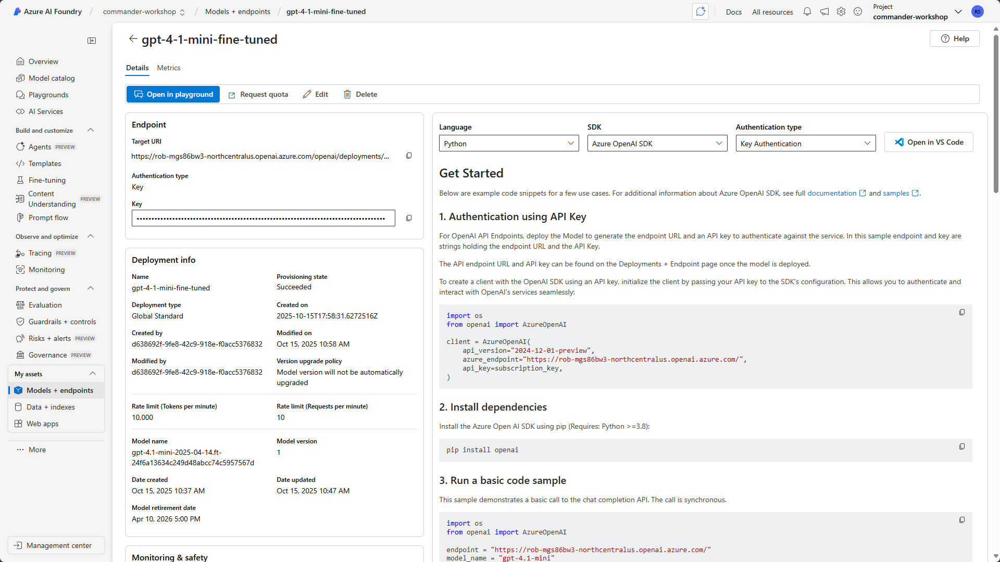

# 🚨 Mission 07: Extend agents with Azure AI

## 🕵️‍♂️ CODENAME: `OPERATION AZURE INTELLIGENCE`

> **⏱️ Operation Time Window:** `~60 minutes`  

## 🎯 Mission Brief

Your agent is powerful on its own, but connecting it to Azure AI unlocks enterprise-grade capabilities. This mission will teach you how to use Azure AI Foundry and Azure AI Search to create intelligent, custom experiences that go beyond out-of-the-box functionality.

By mission's end, you'll have deployed a custom AI model in Azure AI Foundry, integrated it into your agent through custom prompt actions, created a searchable knowledge base in Azure AI Search, and connected it all to your agent for expanded knowledge and capabilities.

## 🔎 Objectives

In this mission, you'll learn:

1. Understanding what Bring Your Own Model (BYOM) and Bring Your Own Data (BYOD) mean in the context of Microsoft Copilot Studio
1. Learning why and when to use BYOM and BYOD capabilities with your agents
1. Exploring how BYOM and BYOD integrate with Copilot Studio agents
1. Deploying AI models in Azure AI Foundry and connecting them via custom prompt actions
1. Creating searchable indexes in Azure AI Search and using them as knowledge sources

## 🤖 What does Bring Your Own Model mean?

Bring Your Own Model (BYOM) allows you to use custom or third-party AI models with your Copilot Studio agents instead of relying solely on the models built into Copilot Studio. This gives you flexibility to choose specialized models that best fit your specific use case. With BYOM, you can choose a model for your agent that meets your specific needs.

### What does BYOM enable?

- **Custom AI capabilities** - use specialized models trained for specific domains like legal, medical, or financial services.
- **Model flexibility** - select from various model providers including Azure OpenAI, open-source models, or your own fine-tuned models.
- **Control and compliance** - maintain control over model selection, deployment location, and data handling to meet regulatory requirements.
- **Cost optimization** - choose models that balance performance with cost based on your workload requirements.

### Types of models you can bring

- **Azure OpenAI models** - GPT-4, GPT-3.5, and other models deployed in your Azure subscription.
- **Azure AI model catalog** - access 1900+ models from the extensive Azure AI Foundry model catalog.
- **Custom fine-tuned models** - models you've trained or fine-tuned on your specific data.
- **Open-source models** - popular models like Llama, Mistral, or Phi deployed in Azure.

## 📊 What does Bring Your Own Data mean?

Bring Your Own Data (BYOD) enables you to connect your own enterprise data sources to your Copilot Studio agents, allowing them to provide grounded, accurate responses based on your organization's information.

### What does BYOD enable?

- **Enterprise knowledge** - ground your agent's responses in your organization's documents, databases, and systems.
- **Accurate information** - reduce hallucinations by connecting to authoritative data sources.
- **Real-time data** - access current information from your systems rather than relying on pre-trained knowledge.
- **Contextual responses** - provide answers that are relevant to your organization's specific context and terminology.

### Types of data sources you can bring

- **Azure AI Search** - searchable indexes of documents, websites, and structured data.
- **SharePoint** - documents and files stored in SharePoint sites.
- **OneDrive** - files stored in OneDrive for Business.
- **Dataverse** - structured data from your Power Platform environment.
- **Custom connectors** - any data source accessible via API.

## 🎯 Why use BYOM and BYOD in Microsoft Copilot Studio agents?

While Copilot Studio provides powerful out-of-the-box capabilities, BYOM and BYOD unlock advanced scenarios that make your agents truly enterprise-ready.

### Reasons to use BYOM

1. **Specialized expertise**
    - Use domain-specific models that understand industry terminology and context better than general-purpose models.
    - Example: a medical terminology model for healthcare agents.

1. **Performance optimization**
    - Select smaller, faster models for simple tasks and larger models for complex reasoning.
    - Balance response time with capability requirements.

1. **Compliance and governance**
    - Deploy models in specific Azure regions to meet data residency requirements.
    - Maintain full control over model versions and updates.

1. **Cost management**
    - Use cost-effective models for high-volume, low-complexity interactions.
    - Reserve premium models for complex scenarios.

1. **Custom capabilities**
    - Leverage models fine-tuned on your organization's data and use cases.
    - Implement specialized capabilities not available in standard models.

### Reasons to use BYOD

1. **Accuracy and reliability**
    - Ground responses in authoritative enterprise data rather than general knowledge.
    - Reduce the risk of hallucinations and incorrect information.

1. **Current information**
    - Access real-time data from your systems.
    - Ensure users receive up-to-date information.

1. **Enterprise context**
    - Provide responses that understand your organization's terminology, processes, and policies.
    - Reference internal documents, guidelines, and knowledge bases.

1. **Compliance**
    - Keep sensitive data within your environment rather than sending it to external services.
    - Maintain audit trails of data access.

1. **Personalization**
    - Tailor responses based on user roles, departments, or permissions.
    - Surface relevant information from the right data sources.

## ⚙️ How BYOM and BYOD work in Microsoft Copilot Studio agents

Understanding how these capabilities integrate with your agent helps you design effective solutions.

### BYOM integration architecture

1. **Model deployment**
    - Deploy your chosen model in Azure AI Foundry.
    - Configure the model endpoint and authentication.

1. **Connection in Copilot Studio**
    - Create a custom prompt action or generative action.
    - Connect to your Azure AI Foundry model endpoint.
    - Configure input parameters and output handling.

1. **Agent invocation**
    - Your agent calls the custom action during conversation.
    - Passes user input and context to the model.
    - Receives and processes the model's response.

1. **Response handling**
    - Parse the model output.
    - Format and present results to the user.
    - Handle errors and fallback scenarios.

### BYOD integration architecture

1. **Data preparation**
    - Index your data in Azure AI Search.
    - Configure field mappings and search capabilities.
    - Set up semantic ranking for improved relevance.

1. **Knowledge source configuration**
    - Add Azure AI Search as a knowledge source in Copilot Studio.
    - Configure authentication and index selection.
    - Define how results should be presented.

1. **Query processing**
    - Agent receives user query.
    - Searches your indexed data for relevant information.
    - Ranks and retrieves top results.

1. **Response generation**
    - Agent uses retrieved data to generate grounded responses.
    - Provides citations and sources to users.
    - Handles cases where no relevant data is found.

### Integration patterns

**Pattern 1: Custom prompt actions with BYOM**

- Use custom prompt actions to call your deployed model.
- Pass specific instructions and user input to the model.
- Receive structured or unstructured responses.
- Best for: specialized processing, custom analysis, domain-specific tasks.

**Pattern 2: Generative actions with BYOM**

- Create actions that combine your model with dynamic inputs.
- Enable the agent to adapt behavior based on conversation context.
- Support multi-step reasoning and complex workflows.
- Best for: multi-turn conversations, complex decision-making, adaptive responses.

**Pattern 3: Knowledge sources with BYOD**

- Configure Azure AI Search as a knowledge source.
- Enable automatic searching during conversations.
- Provide cited, grounded responses to user queries.
- Best for: FAQ handling, document search, information retrieval.

**Pattern 4: Combined BYOM + BYOD**

- Use your custom model to process results from your data sources.
- Enhance retrieval with custom ranking or filtering logic.
- Generate personalized responses based on retrieved data.
- Best for: complex enterprise scenarios, personalized experiences, advanced analytics.

## 🔌 Key capabilities and considerations

### Model capabilities

- **Prompt engineering** - craft effective prompts that guide model behavior.
- **Context management** - pass relevant conversation history and context to the model.
- **Token optimization** - manage input and output token usage for cost efficiency.
- **Error handling** - implement robust error handling for model failures.

### Data capabilities

- **Semantic search** - leverage AI-powered search for better relevance.
- **Hybrid search** - combine keyword and semantic search for comprehensive results.
- **Filtering** - apply filters based on user permissions, departments, or categories.
- **Ranking** - use custom ranking profiles to surface the most relevant results.

### Security and governance

- **Authentication** - secure connections to Azure AI services using managed identities or API keys.
- **Data privacy** - ensure sensitive data remains within your environment.
- **Access control** - implement role-based access to models and data sources.
- **Monitoring** - track usage, performance, and costs across all integrations.

## 🎨 Best practices

1. **Start with use cases**
    - Identify specific scenarios where BYOM or BYOD adds value.
    - Don't over-engineer - use built-in capabilities when they're sufficient.

1. **Choose the right model**
    - Match model capabilities to your use case requirements.
    - Consider cost, latency, and performance trade-offs.

1. **Prepare your data**
    - Ensure data is well-structured and properly indexed.
    - Use semantic ranking for better search relevance.
    - Keep indexes updated with fresh content.

1. **Optimize prompts**
    - Test and refine prompts for your custom models.
    - Include clear instructions and examples.
    - Manage token usage efficiently.

1. **Handle failures gracefully**
    - Implement fallback logic when models or data sources are unavailable.
    - Provide helpful error messages to users.
    - Log issues for monitoring and troubleshooting.

1. **Monitor and optimize**
    - Track usage patterns and costs.
    - Optimize model selection and data retrieval strategies.
    - Continuously improve based on user feedback.

## 🧪 Lab 7.1: Deploy a model in Azure AI Foundry

In this lab, you'll put BYOM into practice by deploying an AI model that you will use in your agent. You'll deploy the Cohere Command R+ model, which is specifically optimized for retrieval-augmented generation (RAG) and knowledge base applications.

### Prerequisites to complete this mission

1. An active Azure subscription with permissions to create resources. If you don't have an Azure subscription, you can [sign up for one](/azure.microsoft.com/pricing/purchase-options/azure-account)

1. Access to [Azure AI Foundry](https://ai.azure.com) through your Azure account

1. Sample documents from [IT documentation](https://download-directory.github.io/?url=https://github.com/RobStand/agent-academy/tree/main/docs/commander/07-extend-with-azure-ai/assets/it-documentation&filename=commander_sampledata).

### 7.1.1 Create AI Foundry resources

1. Navigate to [Azure AI Foundry](https://ai.azure.com) and sign in with your Azure credentials.
    

1. Once you are logged in, navigate to [All resources](https://ai.azure.com/allResources) in AI Foundry.

    Select **Create new**. Choose `AI hub resource` and select **Next**.
    

1. Name your project `commander-workshop`. Rename the hub `commander-hub`. Expand **Advanced options** if you want to specify options, such as a specific resource group name. For this lab, you can accept the defaults.

    Select **Create**.
    

### 7.1.2 Deploy a model

Now that you have AI Foundry resources set up, you can deploy a model.

We're using `Cohere Command R+` because it is the ideal model choice for this scenario. It is specifically designed for document Q&A. It is excellent at technical and policy language and automatically generates accurate inline citations. It stays faithful to source documents, minimizing hallucinations, and handles lengthy policy documents with ease.

1. In the left-hand navigation, select **Models + endpoints**.

1. Select **Deploy model**, then select **Deploy base model**.

    

1. Search for `Cohere-command-r-plus`.

    Select the `Cohere-command-r-plus-08-2024` model and select **Confirm**.
    

1. Because `Cohere-command-r-plus` is available through the Azure Marketplace, AI Foundry will ask you to agree to the Terms of use to proceed with the deployment.

    Select **Agree and Proceed**.
    

1. Leave the default **Deployment name** as `Cohere-command-r-plus-08-2024`. The deployment name will appear in Copilot Studio when you connect to it later, so you will want a memorable name that helps you identify the model easily.

    Select **Deploy**.
    

1. AI Foundry displays the details of your model deployment. Note the following information from the model deployment, as you'll need it later:

    - **Target URI**: This is the URL for our model's endpoint.
    - **API Key**: This is the primary key for authentication.
    - **Deployment name**: This is the name you chose (or left default) when deploying the model.

    

**Important:** Keep your API key secure. Don't share it or commit it to source control.

## 🧪Lab 7.2: Create Azure AI Search resource in Azure AI Foundry

Now let's set up the AI Search index for the IT policies and documentation. You'll use this index as a knowledge source in Copilot Studio later.

### 7.2.1 Add data

Now you will add the IT sample documents to Azure AI Foundry.

1. In **Azure AI Foundry**, in the left navigation, select **Data + indexes**.

    

1. Select the **Data files** tab.

    Select **+ New data**.

1. Select `Upload files/folders` in the **Data source** dropdown.

1. Select `Upload files or folder`, then `Upload files`.

1. Navigate to the folder containing the sample files, select all of them, and select **Open**.

    Select **Next**.

    

1. Enter `it-policies-guides` in **Data name**.

    Select **Create**.

1. The documents are now uploaded to AI Foundry and ready to be used.

    

### 7.2.2 Create the index

1. In **Azure AI Foundry**, in the left navigation, select **Data + indexes**.

    Select the **Indexes** tab.

    Select **+ New index**.

    

1. The **Create a vector index** window will load. This is where you will configure the index in AI Foundry.

   In the **Data source** dropdown, choose `Data in Azure AI Foundry`.

1. Select the `it-policies-guides` folder.

    Select **Next**.

1. Now you need to create an Azure AI Search service to ingest your data. Select **Create a new Azure AI Search resource**.

1. The Azure portal will open in a new window and display **Create a search service**.

    Enter the details.

    **Subscription** - The subscription you're using for this lab.

    **Resource group** - The resource group you created for the AI Foundry project

    **Service name** - Enter a unique name for the service

    **Location** - Select a region where you created your AI Foundry project or another region near you

    **Pricing tier** - Select `Free` since you are using a small set of documents

    Select **Review + create**, then **Create**.

    

1. Wait for the connection to complete (1-2 minutes). You'll see a confirmation message.

    

1. The AI Search resource is now available. Go back to AI Foundry to select the AI Search service you created. In the **Select Azure AI Search service** dropdown, select **Connect other Azure AI Search resource**.

1. In the **Connect an existing resource** window, you should see the Azure AI Search resource you created. Select **Add connection** next to the resource.

    

1. In the **Select Azure AI Search service** dropdown, select your AI Search service.

1. For **Vector index**, enter `it-policies-guides-index`.

    Select **Next**.

1. An embedding model is required for the vector index. In the **Embedding model** dropdown, choose `text-embedding-3-small`. This is a good, low cost embedding model for this scenario.

    Select **Next**.
    

1. Select **Create vector index**. The indexing process will begin automatically and may take a while.

    

Excellent work! You've successfully created an Azure AI Search index with vector embeddings. Your IT policy documents are now searchable and ready to be used as a knowledge source for your Copilot Studio agent.

## 🧪Lab 7.3:  Configure the agent with Azure AI capabilities

Now it's time connect both your Azure AI Search knowledge source and Cohere Command R+ model to create an intelligent IT Policy Assistant.

### 7.3.1 Agent set up

***Does an agent already exist from a previous step? Or should the user create a new one?***

### 7.3.2 Add Azure AI Search as knowledge source

Now you'll connect your IT policies search index as a knowledge source.

1. In your agent, go to **Knowledge** in the left navigation.

1. Click **+ Add knowledge**.

1. Select **Azure AI Search**.

1. Configure the connection:
    - **Connection**: Select your AI Search connection from Azure AI Foundry
    - **Index name**: Select `it-policies-index`
    - **Query type**: Select **Vector + Semantic** (best results with Command R+)
    - **Top K results**: `5` (number of document chunks to retrieve per query)

1. Test the connection by entering a sample query in the test box:

    ```text
    password policy
    ```

1. Review the test results to verify documents are being retrieved correctly.

1. Click **Add** to add the knowledge source.

1. Verify the knowledge source appears in your list.

### 7.3.3: Create a custom prompt action using Command R+

Now you'll create a custom prompt action that explicitly uses Cohere Command R+ with your AI Search knowledge source. This demonstrates the BYOM (Bring Your Own Model) capability.

**Why use a custom prompt action?**
- Makes the RAG (Retrieval-Augmented Generation) flow explicit and transparent
- You control exactly how the model receives search results
- Demonstrates the full integration between AI Search and your custom model
- Allows fine-tuned control over the prompt and response format

1. In your copilot, go to **Actions** in the left navigation.

    

1. Click **+ Add an action**.

    

1. Select **Create a prompt** (may also be labeled "Prompt action" or "Custom prompt").

    

1. Configure the basic action details:
    - **Name**: `Search IT Policies with Command R+`
    - **Description**: `Searches IT policy documents and generates accurate answers with citations using Cohere Command R+`

    

1. Click **Next** or navigate to the **Input** section.

1. Add an input parameter by clicking **+ Add input**:
    - **Name**: `UserQuestion`
    - **Type**: **Text**
    - **Description**: `The user's question about IT policies`
    - **Sample data**: `What is the password policy?`
    - **Required**: Yes ✓

    

1. Click **Next** or navigate to the **Prompt** section.

1. In the **Prompt** section, configure the connection to your AI Search index:
    - Click **Add data source** or **Connect to data**
    - Select **Azure AI Search**
    - Choose your connection and index: `it-policies-guides-index`
    - **Search type**: Vector + Semantic
    - **Top K**: 5

    

1. Now configure the connection to Cohere Command R+:
    - Look for **Model** or **Generative AI** section
    - Select **Use custom Azure endpoint** or **Azure AI Foundry**
    - **Endpoint URL**: Enter your Command R+ endpoint from Lab 2
    - **API Key**: Enter your API key from Lab 2
    - **Deployment name**: `cohere-command-r-plus`
    - **API Version**: Latest

    

1. In the **Prompt** text area, enter the following prompt that combines the user question with retrieved documents:

    ```text
    You are an IT Policy Assistant for Contoso. Answer the user's question using ONLY the information from the provided IT policy documents below.

    ## Instructions
    - Provide accurate, helpful answers based solely on the documents
    - Include citations in this format: [Document Name]
    - If the information is not in the documents, say: "This information is not in our IT policies. Contact IT Support at helpdesk@contoso.com or 1-800-CONTOSO."
    - Be clear, professional, and concise
    - Explain technical terms when needed

    ## Retrieved Policy Documents
    {{DataSources}}

    ## User Question
    {{UserQuestion}}

    ## Your Response
    Provide a clear answer with proper citations:
    ```

    

    **Note:** The `{{DataSources}}` variable will be automatically populated with the chunks retrieved from AI Search. The `{{UserQuestion}}` references your input parameter.

1. Click **Next** or navigate to the **Output** section.

1. Configure the output:
    - **Name**: `PolicyAnswer`
    - **Type**: **Text**
    - **Description**: `The answer generated by Command R+ based on IT policies`

    

1. Click **Save** to save your custom prompt action.

    

### 7.3.4: Add the custom action to a topic

Now you'll create a topic that uses this custom prompt action to answer IT policy questions.

1. Go to **Topics** in the left navigation.

    

1. Click **+ New topic** → **From blank**.

    

1. Name the topic: `IT Policy Questions`

    

1. Add trigger phrases by clicking **Edit** under "Trigger phrases":
    - "I have a question about policy"
    - "What is the policy for"
    - "Tell me about"
    - "How do I"
    - "What should I do"
    - "password policy"
    - "VPN setup"
    - "software request"
    
    (Add more based on your policy documents)

    

1. Click **+** to add a node, then select **Ask a question**.

    

1. Configure the question node:
    - **Message**: `What would you like to know about our IT policies?`
    - **Identify**: Select **User's entire response**
    - **Save response as**: `Topic.UserQuestion`

    

1. Click **+** below the question node and select **Call an action**.

    

1. Select your custom action: **Search IT Policies with Command R+**

    

1. Map the input parameter:
    - For **UserQuestion** input, click the **>** icon
    - Select **Topic.UserQuestion** (the variable from your question node)

    

1. Click **+** below the action node and select **Send a message**.

    

1. In the message node, click **Insert variable** (the `{x}` icon).

    

1. Select the output from your action: **PolicyAnswer**

    

1. The message node should now show: `{Topic.PolicyAnswer}`

    

1. Add one more node: Click **+** and select **Send a message**.

1. Configure this message to ask for follow-up:

    ```text
    Do you have any other questions about our IT policies?
    ```

    

1. **Save** the topic.

    

**What you've built:**
- A custom topic that triggers on IT policy questions
- Uses your custom prompt action that:
  1. Takes the user's question
  2. Searches your AI Search index for relevant policy documents
  3. Sends both the question and retrieved documents to Command R+
  4. Command R+ generates an accurate, cited answer
  5. Returns the answer to the user

This is the complete BYOM + BYOD integration! The flow is:
```
User Question → Topic → Custom Action → AI Search (retrieves docs) → Command R+ (generates answer) → User sees answer
```

## ✅ Mission Complete

Congratulations! 👏🏻 You've successfully extended your Copilot Studio agent with Azure AI capabilities using both BYOM and BYOD approaches.

You've learned how to:

- Deploy custom AI models in Azure AI Foundry
- Create custom prompt actions that leverage your deployed models
- Build searchable knowledge bases with Azure AI Search
- Connect enterprise data sources to your agent for grounded responses

These capabilities unlock powerful enterprise scenarios and allow you to create truly intelligent, context-aware agents that leverage your organization's data and specialized AI models.

## 📚 Tactical Resources

🔗 [Azure AI Foundry documentation](https://learn.microsoft.com/azure/ai-studio/?WT.mc_id=aiml-0000-cxa)

🔗 [Custom prompt actions in Copilot Studio](https://learn.microsoft.com/microsoft-copilot-studio/advanced-generative-actions?WT.mc_id=power-0000-cxa)

🔗 [Azure AI Search documentation](https://learn.microsoft.com/azure/search/?WT.mc_id=aiml-0000-cxa)

🔗 [Knowledge sources in Copilot Studio](https://learn.microsoft.com/microsoft-copilot-studio/knowledge-source-azure-ai-search?WT.mc_id=power-0000-cxa)

🔗 [Best practices for prompt engineering](https://learn.microsoft.com/azure/ai-services/openai/concepts/prompt-engineering?WT.mc_id=aiml-0000-cxa)

📺 [Bring Your Own AI Models to Copilot Studio](https://www.youtube.com/watch?v=example)

📺 [Grounding Copilot with Azure AI Search](https://www.youtube.com/watch?v=example)
