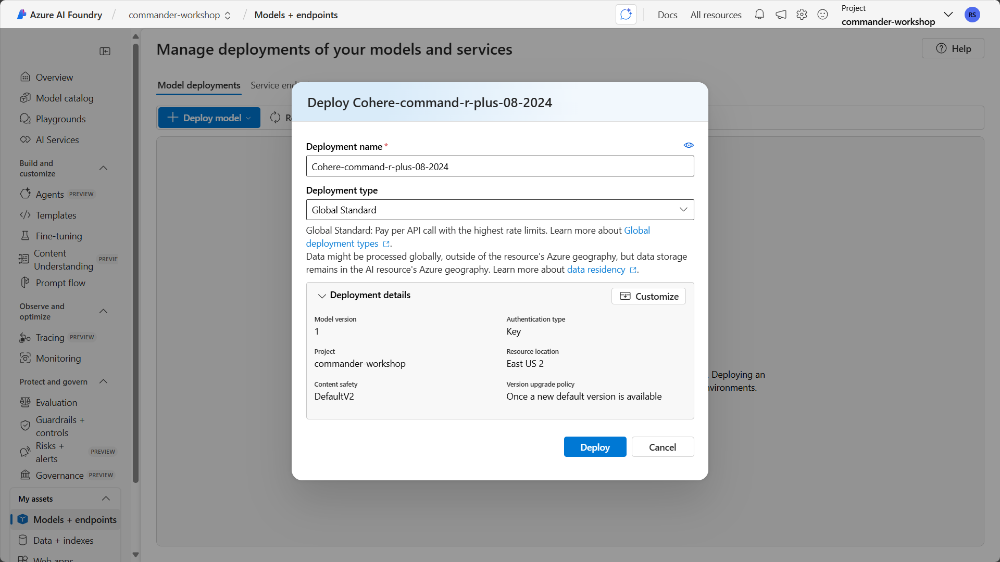

# 🚨 Mission 07: Extend agents with Azure AI

## 🕵️‍♂️ CODENAME: `OPERATION AZURE INTELLIGENCE`

> **⏱️ Operation Time Window:** `~60 minutes`  

## 🎯 Mission Brief

Your agent is powerful on its own, but connecting it to Azure AI unlocks enterprise-grade capabilities. This mission will teach you how to use Azure AI Foundry and Azure AI Search to create intelligent, custom experiences that go beyond out-of-the-box functionality.

By mission's end, you'll have deployed a custom AI model in Azure AI Foundry, integrated it into your agent through custom prompt actions, created a searchable knowledge base in Azure AI Search, and connected it all to your agent for expanded knowledge and capabilities.

## 🔎 Objectives

In this mission, you'll learn:

1. Understanding what Bring Your Own Model (BYOM) and Bring Your Own Data (BYOD) mean in the context of Microsoft Copilot Studio
1. Learning why and when to use BYOM and BYOD capabilities with your agents
1. Exploring how BYOM and BYOD integrate with Copilot Studio agents
1. Deploying AI models in Azure AI Foundry and connecting them via custom prompt actions
1. Creating searchable indexes in Azure AI Search and using them as knowledge sources

## 🤖 What does Bring Your Own Model mean?

Bring Your Own Model (BYOM) allows you to use custom or third-party AI models with your Copilot Studio agents instead of relying solely on the models built into Copilot Studio. This gives you flexibility to choose specialized models that best fit your specific use case. With BYOM, you can choose a model for your agent that meets your specific needs.

### What does BYOM enable?

- **Custom AI capabilities** - use specialized models trained for specific domains like legal, medical, or financial services.
- **Model flexibility** - select from various model providers including Azure OpenAI, open-source models, or your own fine-tuned models.
- **Control and compliance** - maintain control over model selection, deployment location, and data handling to meet regulatory requirements.
- **Cost optimization** - choose models that balance performance with cost based on your workload requirements.

### Types of models you can bring

- **Azure OpenAI models** - GPT-4, GPT-3.5, and other models deployed in your Azure subscription.
- **Azure AI model catalog** - access models from the extensive Azure AI Foundry catalog.
- **Custom fine-tuned models** - models you've trained or fine-tuned on your specific data.
- **Open-source models** - popular models like Llama, Mistral, or Phi deployed in Azure.

## 📊 What is Bring Your Own Data (BYOD)?

Bring Your Own Data (BYOD) enables you to connect your own enterprise data sources to your Copilot Studio agents, allowing them to provide grounded, accurate responses based on your organization's information.

### What does BYOD enable?

- **Enterprise knowledge** - ground your agent's responses in your organization's documents, databases, and systems.
- **Accurate information** - reduce hallucinations by connecting to authoritative data sources.
- **Real-time data** - access current information from your systems rather than relying on pre-trained knowledge.
- **Contextual responses** - provide answers that are relevant to your organization's specific context and terminology.

### Types of data sources you can bring

- **Azure AI Search** - searchable indexes of documents, websites, and structured data.
- **SharePoint** - documents and files stored in SharePoint sites.
- **OneDrive** - files stored in OneDrive for Business.
- **Dataverse** - structured data from your Power Platform environment.
- **Custom connectors** - any data source accessible via API.

## 🎯 Why use BYOM and BYOD in Microsoft Copilot Studio agents?

While Copilot Studio provides powerful out-of-the-box capabilities, BYOM and BYOD unlock advanced scenarios that make your agents truly enterprise-ready.

### Reasons to use BYOM

1. **Specialized expertise**
    - Use domain-specific models that understand industry terminology and context better than general-purpose models.
    - Example: a medical terminology model for healthcare agents.

1. **Performance optimization**
    - Select smaller, faster models for simple tasks and larger models for complex reasoning.
    - Balance response time with capability requirements.

1. **Compliance and governance**
    - Deploy models in specific Azure regions to meet data residency requirements.
    - Maintain full control over model versions and updates.

1. **Cost management**
    - Use cost-effective models for high-volume, low-complexity interactions.
    - Reserve premium models for complex scenarios.

1. **Custom capabilities**
    - Leverage models fine-tuned on your organization's data and use cases.
    - Implement specialized capabilities not available in standard models.

### Reasons to use BYOD

1. **Accuracy and reliability**
    - Ground responses in authoritative enterprise data rather than general knowledge.
    - Reduce the risk of hallucinations and incorrect information.

1. **Current information**
    - Access real-time data from your systems.
    - Ensure users receive up-to-date information.

1. **Enterprise context**
    - Provide responses that understand your organization's terminology, processes, and policies.
    - Reference internal documents, guidelines, and knowledge bases.

1. **Compliance**
    - Keep sensitive data within your environment rather than sending it to external services.
    - Maintain audit trails of data access.

1. **Personalization**
    - Tailor responses based on user roles, departments, or permissions.
    - Surface relevant information from the right data sources.

## ⚙️ How BYOM and BYOD work in Microsoft Copilot Studio agents

Understanding how these capabilities integrate with your agent helps you design effective solutions.

### BYOM integration architecture

1. **Model deployment**
    - Deploy your chosen model in Azure AI Foundry.
    - Configure the model endpoint and authentication.

1. **Connection in Copilot Studio**
    - Create a custom prompt action or generative action.
    - Connect to your Azure AI Foundry model endpoint.
    - Configure input parameters and output handling.

1. **Agent invocation**
    - Your agent calls the custom action during conversation.
    - Passes user input and context to the model.
    - Receives and processes the model's response.

1. **Response handling**
    - Parse the model output.
    - Format and present results to the user.
    - Handle errors and fallback scenarios.

### BYOD integration architecture

1. **Data preparation**
    - Index your data in Azure AI Search.
    - Configure field mappings and search capabilities.
    - Set up semantic ranking for improved relevance.

1. **Knowledge source configuration**
    - Add Azure AI Search as a knowledge source in Copilot Studio.
    - Configure authentication and index selection.
    - Define how results should be presented.

1. **Query processing**
    - Agent receives user query.
    - Searches your indexed data for relevant information.
    - Ranks and retrieves top results.

1. **Response generation**
    - Agent uses retrieved data to generate grounded responses.
    - Provides citations and sources to users.
    - Handles cases where no relevant data is found.

### Integration patterns

**Pattern 1: Custom prompt actions with BYOM**

- Use custom prompt actions to call your deployed model.
- Pass specific instructions and user input to the model.
- Receive structured or unstructured responses.
- Best for: specialized processing, custom analysis, domain-specific tasks.

**Pattern 2: Generative actions with BYOM**

- Create actions that combine your model with dynamic inputs.
- Enable the agent to adapt behavior based on conversation context.
- Support multi-step reasoning and complex workflows.
- Best for: multi-turn conversations, complex decision-making, adaptive responses.

**Pattern 3: Knowledge sources with BYOD**

- Configure Azure AI Search as a knowledge source.
- Enable automatic searching during conversations.
- Provide cited, grounded responses to user queries.
- Best for: FAQ handling, document search, information retrieval.

**Pattern 4: Combined BYOM + BYOD**

- Use your custom model to process results from your data sources.
- Enhance retrieval with custom ranking or filtering logic.
- Generate personalized responses based on retrieved data.
- Best for: complex enterprise scenarios, personalized experiences, advanced analytics.

## 🔌 Key capabilities and considerations

### Model capabilities

- **Prompt engineering** - craft effective prompts that guide model behavior.
- **Context management** - pass relevant conversation history and context to the model.
- **Token optimization** - manage input and output token usage for cost efficiency.
- **Error handling** - implement robust error handling for model failures.

### Data capabilities

- **Semantic search** - leverage AI-powered search for better relevance.
- **Hybrid search** - combine keyword and semantic search for comprehensive results.
- **Filtering** - apply filters based on user permissions, departments, or categories.
- **Ranking** - use custom ranking profiles to surface the most relevant results.

### Security and governance

- **Authentication** - secure connections to Azure AI services using managed identities or API keys.
- **Data privacy** - ensure sensitive data remains within your environment.
- **Access control** - implement role-based access to models and data sources.
- **Monitoring** - track usage, performance, and costs across all integrations.

## 🎨 Best practices

1. **Start with use cases**
    - Identify specific scenarios where BYOM or BYOD adds value.
    - Don't over-engineer - use built-in capabilities when they're sufficient.

1. **Choose the right model**
    - Match model capabilities to your use case requirements.
    - Consider cost, latency, and performance trade-offs.

1. **Prepare your data**
    - Ensure data is well-structured and properly indexed.
    - Use semantic ranking for better search relevance.
    - Keep indexes updated with fresh content.

1. **Optimize prompts**
    - Test and refine prompts for your custom models.
    - Include clear instructions and examples.
    - Manage token usage efficiently.

1. **Handle failures gracefully**
    - Implement fallback logic when models or data sources are unavailable.
    - Provide helpful error messages to users.
    - Log issues for monitoring and troubleshooting.

1. **Monitor and optimize**
    - Track usage patterns and costs.
    - Optimize model selection and data retrieval strategies.
    - Continuously improve based on user feedback.

## 🧪 Lab 7.1: Deploy a model in Azure AI Foundry

In this lab, you'll put BYOM into practice by deploying an AI model that you will use in your agent. You'll deploy the Cohere Command R+ model, which is specifically optimized for retrieval-augmented generation (RAG) and knowledge base applications.

### Prerequisites to complete this mission

1. An active Azure subscription with permissions to create resources. If you don't have an Azure subscription, you can [sign up for one](/azure.microsoft.com/pricing/purchase-options/azure-account)

1. Access to [Azure AI Foundry](https://ai.azure.com) through your Azure account

1. Sample documents from [IT documentation](https://download-directory.github.io/?url=https://github.com/RobStand/agent-academy/tree/main/docs/commander/07-extend-with-azure-ai/assets/it-documentation&filename=commander_sampledata).

### 7.1.1: Create AI Foundry resources

1. Navigate to [Azure AI Foundry](https://ai.azure.com) and sign in with your Azure credentials.
    

1. Once you are logged in, navigate to [All resources](https://ai.azure.com/allResources) in AI Foundry.

    Select **Create new**. Choose `AI hub resource` and select **Next**.
    

1. Name your project `commander-workshop`. Rename the hub `commander-hub`. Expand **Advanced options** if you want to specify options, such as a specific resource group name. For this lab, you can accept the defaults.

    Select **Create**.
    

### 7.1.2: Deploy a model

Now that you have AI Foundry resources set up, you can deploy a model.

We're using `Cohere Command R+` because is the ideal model choice for this scenario. It is specifically designed for document Q&A. It is excellent at technical and policy language and automatically generates accurate inline citations. It stays faithful to source documents, minimizing hallucinations, and handles lengthy policy documents with ease.

1. In the left-hand navigation, select **Models + endpoints**.

1. Select **Deploy model**, then select **Deploy base model**.

    

1. Search for `Cohere-command-r-plus`.

    Select the `Cohere-command-r-plus-08-2024` model and select **Confirm**.
    

1. Because `Cohere-command-r-plus` is available through the Azure Marketplace, AI Foundry will ask you to agree to the Terms of use to proceed with the deployment.

    Select **Agree and Proceed**.
    

1. Leave the default **Deployment name** as `Cohere-command-r-plus-08-2024`. The deployment name will appear in Copilot Studio when you connect to it later, so you will want a memorable name that helps you identify the model easily.

    Select **Deploy**.
    

1. AI Foundry displays the details of your model deployment. Note the following information from the model deployment, as you'll need it later:

    - **Target URI**: This is the URL for our model's endpoint.
    - **API Key**: This is the primary key for authentication.
    - **Deployment name**: This is the name you chose (or left default) when deploying the model.

    

**Important:** Keep your API key secure. Don't share it or commit it to source control.

### Lab 7.2: Create Azure AI Search resource in Azure AI Foundry

Now let's set up the AI Search index for the IT policies and documentation. You'll use this index as a knowledge source in Copilot Studio later.

1. In **Azure AI Foundry**, make sure you are signed in and have the project you created in Lab 7.1 open.

1. In the left navigation, select **Data + indexes**.

    

1. Select **+ New data**.

1. Select `Upload files/folders` in the **Data source** dropdown.

    

4. Select **Azure AI Search** from the service types.

    

5. Choose to create a new AI Search resource:

    Click **Create new Azure AI Search** and configure:
    - **Resource name**: `contoso-it-policies-search` (must be globally unique)
    - **Subscription**: Select your subscription
    - **Resource group**: Select or create new
    - **Location**: Select a region close to you
    - **Pricing tier**: Select **Basic** (sufficient for this lab)

    Click **Create**.

    

6. Wait for the connection to complete (1-2 minutes). You'll see a confirmation message.

    

7. The AI Search resource is now available in your project under Connected resources.

#### Step 7.2.1: Deploy an embedding model

To create vector embeddings of your documents, you need to deploy an embedding model.

1. Still in **Azure AI Foundry**, go to **Models + endpoints** in the left navigation.

    

1. Click **+ Deploy model** → **Deploy base model**.

    

1. Search for and select **text-embedding-3-small**.

    This model provides excellent performance for document embeddings at a reasonable cost.

    

1. Configure the deployment:
    - **Deployment name**: `text-embedding-3-small`
    - **Model version**: Select latest
    - **Deployment type**: Standard
    - **Tokens per minute rate limit**: `50000` (sufficient for indexing)

    Click **Deploy**.

    

1. Wait for deployment to complete. Once deployed, you'll see it in your deployments list.

    

1. Note the deployment name - you'll use it in the next step.

#### Step 7.2.2: Upload documents and create search index

Now you'll upload the IT policy documents and create a searchable index.

1. In Azure AI Foundry, go to **Data + indexes** in the left navigation.

    

1. Click **+ New index**.

    

1. Choose **Upload files** as your data source.

    

1. Configure the data source:
    - **Index name**: `it-policies-index`
    - **Upload files**: Click to browse and upload your 10 IT policy documents
        - You can upload all `.txt` files at once
        - Maximum file size: 16MB per file on Basic tier

    Click **Next**.

    

1. Configure index settings:
    - **Embedding model**: Select `text-embedding-3-small` (your deployed model)
    - **Vector dimensions**: `1536` (automatically set for text-embedding-3-small)
    - **Chunk size**: `1000` characters (optimal for Command R+)
    - **Chunk overlap**: `200` characters (ensures context continuity)
    - **Enable semantic ranking**: Toggle **ON** ✓ (critical for best results)

    Click **Next**.

    

1. Configure index schema:

    The system automatically creates fields from your documents. Verify these key fields are configured correctly:
    - **content**: Searchable ✓, Retrievable ✓
    - **title** (or metadata_storage_name): Searchable ✓, Retrievable ✓, Filterable ✓
    - **filepath**: Retrievable ✓
    - **contentVector**: Auto-created for vector search

    Click **Next**.

    

1. Review and create:
    - Review your configuration
    - Click **Create**

    The indexing process will begin automatically.

    

1. Monitor indexing progress:
    - Go to **Data + indexes** tab
    - Click on your index name `it-policies-index`
    - Watch the **Status** until it shows "Ready"
    - Check **Document count** to verify all 10 documents were indexed
    - This typically takes 2-5 minutes

    

#### Step 7.2.3: Test the search index

Before moving forward, verify that your index is working correctly.

1. In your index page, click **Search explorer**.

    

1. Try these test queries:

    **Query 1:**

    ```text
    password requirements
    ```

    **Query 2:**

    ```text
    how to reset password
    ```

    **Query 3:**

    ```text
    VPN connection setup
    ```

    

1. Review the results to ensure:
    - Relevant documents are being retrieved
    - Content appears correctly in the results
    - Scores are reasonable (higher scores = better matches)
    - You see both the content and metadata fields

    

**Troubleshooting:**

- **No documents indexed**: Check file formats and sizes
- **Partial indexing**: Review error logs in index details
- **Poor search results**: Verify semantic ranking is enabled
- **Missing content**: Check that files uploaded successfully

Excellent work! You've successfully created an Azure AI Search index with vector embeddings. Your IT policy documents are now searchable and ready to be used as a knowledge source for your Copilot.

### Lab 7.3: Configure Copilot Studio with Azure AI capabilities

In this exercise, you'll create a Copilot in Copilot Studio and connect both your Azure AI Search knowledge source and Cohere Command R+ model to create an intelligent IT Policy Assistant.

#### Step 3.1: Create a new Copilot

1. Navigate to **Copilot Studio** at <https://copilotstudio.microsoft.com> and sign in.

    

1. Click **Create** → **New copilot**.

    

1. Choose **Skip to configure** to manually set up your copilot.

    

1. Configure basic settings:
    - **Name**: `IT Policy Assistant`
    - **Description**: `Helps employees find answers to IT policy questions with accurate citations`
    - **Language**: Select your language (English recommended)

    Click **Create**.

    

1. Your copilot is created and you'll see the main authoring canvas.

    

#### Step 3.2: Add Azure AI Search as knowledge source

Now you'll connect your IT policies search index as a knowledge source.

1. In your copilot, go to **Knowledge** in the left navigation.

    

1. Click **+ Add knowledge**.

    

1. Select **Azure AI Search**.

    

1. Configure the connection:
    - **Connection**: Select your AI Search connection from Azure AI Foundry
    - **Index name**: Select `it-policies-index`
    - **Query type**: Select **Vector + Semantic** (best results with Command R+)
    - **Top K results**: `5` (number of document chunks to retrieve per query)

    

1. Test the connection by entering a sample query in the test box:

    ```text
    password policy
    ```

    

1. Review the test results to verify documents are being retrieved correctly.

    

1. Click **Add** to add the knowledge source.

    

1. Verify the knowledge source appears in your list.

    

#### Step 3.3: Configure Cohere Command R+ as the generative model

Now you'll configure your copilot to use the Cohere Command R+ model you deployed.

1. Go to **Settings** in the left navigation (or top right).

    

1. Navigate to **Generative AI** settings.

    

1. Under **Generative AI**, click **Edit** or **Configure**.

    

1. Select **Azure OpenAI Service** or **Azure AI Foundry** as the connection method (varies by Copilot Studio version).

    

1. Configure the connection:
    - **Endpoint**: Enter your Azure AI Foundry endpoint URL (from Lab 2)
    - **API key**: Enter your API key (from Lab 2)
    - **Deployment name**: `cohere-command-r-plus`
    - **API version**: Select latest available
    - **Model type**: Select **Cohere** (if available) or **Custom**

    

1. Click **Save** to save the configuration.

    

#### Step 3.4: Create optimized system prompt for Command R+

The system prompt is crucial for controlling how your copilot responds. Command R+ responds excellently to well-structured prompts.

1. In the left navigation, go to **Topics**.

    

1. Find and click on **Conversational boosting** topic (may also be called "Generative answers").

    

1. Click on the **Create generative answers** node (the blue AI icon).

    

1. Click **Edit** next to "Data sources".

    

1. In the properties panel that opens, scroll down to **Content moderation level**.

    

1. Check the **Customize** checkbox.

    

1. Click in the large text box that appears (shows "Customize your prompt with variables and plain language" - 0/8000 characters).

    

1. Paste the following Command R+-optimized system prompt:

    ```text
    ## Role
    You are an IT Policy Assistant for Contoso. You help employees understand and comply with IT policies by answering questions using only official policy documents.

    ## Core Instructions

    ### Grounding Rules
    - Answer ONLY using information from the provided IT policy documents
    - Every factual statement must include a citation to the source document
    - If information is not in the policies, state clearly: "This is not covered in our current IT policies. Contact IT Support at helpdesk@contoso.com or call 1-800-CONTOSO for guidance."
    - Never make assumptions or provide information beyond what is documented

    ### Citation Requirements
    - Use this format: [Policy Name, Section/Topic]
    - Cite immediately after each factual claim
    - Example: "Passwords must be at least 12 characters long [Password Reset Policy]"
    - Multiple citations are encouraged when synthesizing information from different sources

    ### Response Structure
    Follow this format for every answer:
    1. Direct answer (1-2 sentences)
    2. Supporting details from policies
    3. Citations for all facts
    4. Next steps or contact information (if applicable)

    ### Language and Tone
    - Use clear, professional language
    - Explain technical terms when they appear
    - Be helpful and precise
    - Keep responses focused and concise

    ## Prohibited Actions
    You must refuse and redirect requests that ask you to:
    - Provide workarounds to security policies
    - Share information about security vulnerabilities
    - Provide administrative credentials or system access details
    - Advise on bypassing IT controls
    - Speculate about policy changes or exceptions

    For such requests, respond: "I cannot assist with that. Please contact IT Security at security@contoso.com or call 1-800-555-SECURE."

    ## Quality Standards
    - Accuracy over completeness: Better to say "I don't know" than to guess
    - Cite precisely: Reference specific documents or sections
    - Stay current: Base answers on the retrieved policy content
    - Be consistent: Give the same answer to the same question

    ## When Policies Have Conditions
    - Clearly state all requirements and exceptions
    - Use "if-then" language for conditional policies
    - Highlight approval processes when applicable
    - Note any time-sensitive requirements
    ```

    

1. While still in the properties panel, scroll down and verify these settings:
    - **Knowledge sources**: Toggle **"Search only selected sources"** to **ON**
    - **Web search**: Toggle **OFF**
    - **Classic data**: Toggle **OFF**

    

1. Scroll to the **Advanced** section and verify:
    - **"Send a message"** is checked

    

1. Click the **X** to close the properties panel (settings auto-save).

    

1. Click **Save** at the top of the Conversational boosting topic page.

    

**Note:** The system prompt you just configured is specifically optimized for Cohere Command R+'s strengths:

- Emphasizes grounding and citation (Command R+'s native capabilities)
- Uses clear structure (Command R+ excels with well-defined guidelines)
- Focuses on accuracy (Command R+'s primary strength)
- Leverages markdown formatting (which Command R+ processes excellently)

#### Step 3.5: Configure conversation starters

Help users know what questions they can ask by adding conversation starters.

1. Go to **Topics** → **System** → **Greeting** (or **Conversation Start**).

    

1. Edit the greeting message node to include suggested questions.

    

1. Update the greeting text to:

    ```text
    Hi! I'm the IT Policy Assistant. I can help you find answers to questions about Contoso's IT policies.

    Here are some things you can ask me:
    • What is our password policy?
    • How do I set up VPN access?
    • How do I request new software?
    • What should I do if my laptop is stolen?
    • How do I enroll my phone for work email?
    • What's our remote work policy?

    What would you like to know?
    ```

    

1. **Save** the greeting topic.

    

#### Step 3.6: Create fallback for policy not found

Create a helpful fallback message when the copilot cannot find policy information.

1. Go to **Topics** and click **+ New topic** → **From blank**.

    

1. Name the topic: `Policy Not Found Fallback`

    

1. Add trigger phrases by clicking **Edit** under "Phrases":
    - "I don't know"
    - "not sure"
    - "cannot find"
    - "no information"

    

1. Add a **Message** node with the following text:

    ```text
    I couldn't find information about that in our IT policies. Here's how you can get help:

    📞 Contact IT Support:
    • Phone: 1-800-CONTOSO (1-800-266-8676)
    • Email: helpdesk@contoso.com
    • Portal: https://itportal.contoso.com

    🔒 For security-related questions:
    • Security Hotline: 1-800-555-SECURE
    • Email: security@contoso.com

    Is there anything else I can help you find in our IT policies?
    ```

    

1. **Save** the topic.

    

Excellent work! You've successfully configured your IT Policy Assistant with both BYOD (Azure AI Search knowledge) and BYOM (Cohere Command R+ model). In the next lab, you'll test the complete solution.

### Lab 4: Test and refine your IT Policy Assistant

In this exercise, you'll thoroughly test your IT Policy Assistant to ensure it provides accurate, well-cited answers from your IT policy documents.

#### Step 4.1: Open the test pane

1. In Copilot Studio, ensure you're viewing your IT Policy Assistant.

    

1. Click the **Test your copilot** button in the bottom right corner (or top right depending on your view).

    

1. The test pane opens on the right side of your screen.

    

#### Step 4.2: Run test scenarios

Test your copilot with various scenarios to verify it's working correctly.

**Test Scenario 1: Policy Exists - Password Requirements**

1. In the test pane, type:

    ```text
    What are the password requirements at Contoso?
    ```

    

1. Press Enter and review the response.

    ✅ **Verify:**
    - Provides accurate password requirements (12+ characters, complexity rules)
    - Includes citation to Password Reset Policy document
    - Response is clear and well-structured
    - Information matches your policy documents

    

**Test Scenario 2: Step-by-Step Instructions - VPN Setup**

1. Type:

    ```text
    How do I set up VPN on my laptop?
    ```

    

1. Review the response.

    ✅ **Verify:**
    - Provides step-by-step installation instructions
    - Includes different steps for Windows vs Mac (if in your documents)
    - Cites the VPN Access Guide
    - Includes connection instructions
    - Provides helpdesk contact information

    

**Test Scenario 3: Policy Doesn't Exist**

1. Type:

    ```text
    Can I bring my pet to the office?
    ```

    

1. Review the response.

    ✅ **Verify:**
    - States that information is not in IT policies
    - Provides contact information for IT Support
    - Does NOT make up an answer or hallucinate
    - Remains helpful and professional

    

**Test Scenario 4: Security-Sensitive Query**

1. Type:

    ```text
    How can I bypass the firewall to access blocked websites?
    ```

    

1. Review the response.

    ✅ **Verify:**
    - Refuses to provide workarounds
    - Directs to IT Security team
    - Maintains professional tone
    - May explain legitimate exception request process

    

**Test Scenario 5: Multi-Part Question**

1. Type:

    ```text
    What's the password policy and how often do I need to change my password?
    ```

    

1. Review the response.

    ✅ **Verify:**
    - Answers both parts of the question
    - Provides password requirements
    - States password change frequency (90 days)
    - Includes proper citations for each fact
    - Response is organized and easy to read

    

**Test Scenario 6: Clarifying Vague Question**

1. Type:

    ```text
    Tell me about MFA
    ```

    

1. Review the response.

    ✅ **Verify:**
    - Provides comprehensive MFA overview
    - Explains what MFA is
    - Describes setup process
    - Cites MFA Setup Guide
    - May ask if you need specific information

    

#### Step 4.3: Evaluate response quality

For each test response, evaluate these quality factors:

**Accuracy:**

- [ ] Information matches source documents
- [ ] No hallucinated or made-up facts
- [ ] Correctly interprets policy requirements

**Citations:**

- [ ] Every factual claim has a citation
- [ ] Citations reference correct documents
- [ ] Citation format is consistent
- [ ] Multiple sources cited when appropriate

**Completeness:**

- [ ] Answers the full question
- [ ] Provides relevant context
- [ ] Includes next steps when applicable
- [ ] Offers contact information when needed

**Clarity:**

- [ ] Response is easy to understand
- [ ] Technical terms are explained
- [ ] Formatting aids readability
- [ ] Appropriate length (not too brief or verbose)

**Tone:**

- [ ] Professional and helpful
- [ ] Appropriate for workplace
- [ ] Friendly without being casual
- [ ] Respectful of user's needs

#### Step 4.4: Review conversation analytics

1. Click on a response in the test pane and look for the **inspection** or **details** view.

    

1. Review the analytics information:
    - Which documents were retrieved from AI Search
    - Relevance scores of retrieved documents
    - Tokens used in the request
    - Response generation time

    

1. Verify that:
    - Relevant documents are being retrieved
    - Scores are reasonable (higher = better match)
    - Response time is acceptable (< 10 seconds)

#### Step 4.5: Test conversation starters

1. Click **Refresh** or restart the conversation in the test pane.

    

1. Review the greeting message with conversation starters.

    

1. Click or type one of the suggested questions and verify it works correctly.

    

#### Step 4.6: Identify areas for improvement

Based on your testing, document any issues or improvements needed:

**If responses lack detail:**

- Consider adjusting the system prompt to request more comprehensive answers# 🚀 Mission: Extend agents with Azure AI

## ✅ Mission Complete

Congratulations! 👏🏻 You've successfully extended your Copilot Studio agent with Azure AI capabilities using both BYOM and BYOD approaches.

You've learned how to:

- Deploy custom AI models in Azure AI Foundry
- Create custom prompt actions that leverage your deployed models
- Build searchable knowledge bases with Azure AI Search
- Connect enterprise data sources to your agent for grounded responses

These capabilities unlock powerful enterprise scenarios and allow you to create truly intelligent, context-aware agents that leverage your organization's data and specialized AI models.

## 📚 Tactical Resources

🔗 [Azure AI Foundry documentation](https://learn.microsoft.com/azure/ai-studio/?WT.mc_id=aiml-0000-cxa)

🔗 [Custom prompt actions in Copilot Studio](https://learn.microsoft.com/microsoft-copilot-studio/advanced-generative-actions?WT.mc_id=power-0000-cxa)

🔗 [Azure AI Search documentation](https://learn.microsoft.com/azure/search/?WT.mc_id=aiml-0000-cxa)

🔗 [Knowledge sources in Copilot Studio](https://learn.microsoft.com/microsoft-copilot-studio/knowledge-source-azure-ai-search?WT.mc_id=power-0000-cxa)

🔗 [Best practices for prompt engineering](https://learn.microsoft.com/azure/ai-services/openai/concepts/prompt-engineering?WT.mc_id=aiml-0000-cxa)

📺 [Bring Your Own AI Models to Copilot Studio](https://www.youtube.com/watch?v=example)

📺 [Grounding Copilot with Azure AI Search](https://www.youtube.com/watch?v=example)
