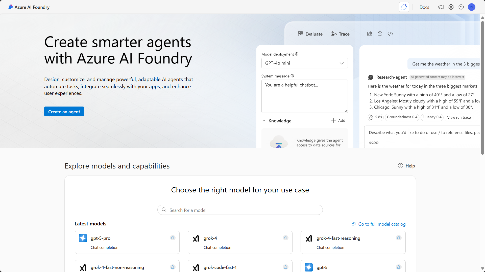

# 🚨 Mission 07: Extend agents with Azure AI

## 🕵️‍♂️ CODENAME: `OPERATION AZURE INTELLIGENCE`

> **⏱️ Operation Time Window:** `~60 minutes`  

## 🎯 Mission Brief

Your agent is powerful on its own, but connecting it to Azure AI unlocks enterprise-grade capabilities. This mission will teach you how to use Azure AI Foundry and Azure AI Search to create intelligent, custom experiences that go beyond out-of-the-box functionality.

By mission's end, you'll have deployed a custom AI model in Azure AI Foundry, integrated it into your agent through custom prompt actions, created a searchable knowledge base in Azure AI Search, and connected it all to your agent for expanded knowledge and capabilities.

## 🔎 Objectives

In this mission, you'll learn:

1. Understanding what Bring Your Own Model (BYOM) and Bring Your Own Data (BYOD) mean in the context of Microsoft Copilot Studio
1. Learning why and when to use BYOM and BYOD capabilities with your agents
1. Exploring how BYOM and BYOD integrate with Copilot Studio agents
1. Deploying AI models in Azure AI Foundry and connecting them via custom prompt actions
1. Creating searchable indexes in Azure AI Search and using them as knowledge sources

## 🤖 What does Bring Your Own Model mean?

Bring Your Own Model (BYOM) allows you to use custom or third-party AI models with your Copilot Studio agents instead of relying solely on the models built into Copilot Studio. This gives you flexibility to choose specialized models that best fit your specific use case. With BYOM, you can choose a model for your agent that meets your specific needs.

### What does BYOM enable?

- **Custom AI capabilities** - use specialized models trained for specific domains like legal, medical, or financial services.
- **Model flexibility** - select from various model providers including Azure OpenAI, open-source models, or your own fine-tuned models.
- **Control and compliance** - maintain control over model selection, deployment location, and data handling to meet regulatory requirements.
- **Cost optimization** - choose models that balance performance with cost based on your workload requirements.

### Types of models you can bring

- **Azure OpenAI models** - GPT-4, GPT-3.5, and other models deployed in your Azure subscription.
- **Azure AI model catalog** - access models from the extensive Azure AI Foundry catalog.
- **Custom fine-tuned models** - models you've trained or fine-tuned on your specific data.
- **Open-source models** - popular models like Llama, Mistral, or Phi deployed in Azure.

## 📊 What is Bring Your Own Data (BYOD)?

Bring Your Own Data (BYOD) enables you to connect your own enterprise data sources to your Copilot Studio agents, allowing them to provide grounded, accurate responses based on your organization's information.

### What does BYOD enable?

- **Enterprise knowledge** - ground your agent's responses in your organization's documents, databases, and systems.
- **Accurate information** - reduce hallucinations by connecting to authoritative data sources.
- **Real-time data** - access current information from your systems rather than relying on pre-trained knowledge.
- **Contextual responses** - provide answers that are relevant to your organization's specific context and terminology.

### Types of data sources you can bring

- **Azure AI Search** - searchable indexes of documents, websites, and structured data.
- **SharePoint** - documents and files stored in SharePoint sites.
- **OneDrive** - files stored in OneDrive for Business.
- **Dataverse** - structured data from your Power Platform environment.
- **Custom connectors** - any data source accessible via API.

## 🎯 Why use BYOM and BYOD in Microsoft Copilot Studio agents?

While Copilot Studio provides powerful out-of-the-box capabilities, BYOM and BYOD unlock advanced scenarios that make your agents truly enterprise-ready.

### Reasons to use BYOM

1. **Specialized expertise**
    - Use domain-specific models that understand industry terminology and context better than general-purpose models.
    - Example: a medical terminology model for healthcare agents.

1. **Performance optimization**
    - Select smaller, faster models for simple tasks and larger models for complex reasoning.
    - Balance response time with capability requirements.

1. **Compliance and governance**
    - Deploy models in specific Azure regions to meet data residency requirements.
    - Maintain full control over model versions and updates.

1. **Cost management**
    - Use cost-effective models for high-volume, low-complexity interactions.
    - Reserve premium models for complex scenarios.

1. **Custom capabilities**
    - Leverage models fine-tuned on your organization's data and use cases.
    - Implement specialized capabilities not available in standard models.

### Reasons to use BYOD

1. **Accuracy and reliability**
    - Ground responses in authoritative enterprise data rather than general knowledge.
    - Reduce the risk of hallucinations and incorrect information.

1. **Current information**
    - Access real-time data from your systems.
    - Ensure users receive up-to-date information.

1. **Enterprise context**
    - Provide responses that understand your organization's terminology, processes, and policies.
    - Reference internal documents, guidelines, and knowledge bases.

1. **Compliance**
    - Keep sensitive data within your environment rather than sending it to external services.
    - Maintain audit trails of data access.

1. **Personalization**
    - Tailor responses based on user roles, departments, or permissions.
    - Surface relevant information from the right data sources.

## ⚙️ How BYOM and BYOD work in Microsoft Copilot Studio agents

Understanding how these capabilities integrate with your agent helps you design effective solutions.

### BYOM integration architecture

1. **Model deployment**
    - Deploy your chosen model in Azure AI Foundry.
    - Configure the model endpoint and authentication.

1. **Connection in Copilot Studio**
    - Create a custom prompt action or generative action.
    - Connect to your Azure AI Foundry model endpoint.
    - Configure input parameters and output handling.

1. **Agent invocation**
    - Your agent calls the custom action during conversation.
    - Passes user input and context to the model.
    - Receives and processes the model's response.

1. **Response handling**
    - Parse the model output.
    - Format and present results to the user.
    - Handle errors and fallback scenarios.

### BYOD integration architecture

1. **Data preparation**
    - Index your data in Azure AI Search.
    - Configure field mappings and search capabilities.
    - Set up semantic ranking for improved relevance.

1. **Knowledge source configuration**
    - Add Azure AI Search as a knowledge source in Copilot Studio.
    - Configure authentication and index selection.
    - Define how results should be presented.

1. **Query processing**
    - Agent receives user query.
    - Searches your indexed data for relevant information.
    - Ranks and retrieves top results.

1. **Response generation**
    - Agent uses retrieved data to generate grounded responses.
    - Provides citations and sources to users.
    - Handles cases where no relevant data is found.

### Integration patterns

**Pattern 1: Custom prompt actions with BYOM**

- Use custom prompt actions to call your deployed model.
- Pass specific instructions and user input to the model.
- Receive structured or unstructured responses.
- Best for: specialized processing, custom analysis, domain-specific tasks.

**Pattern 2: Generative actions with BYOM**

- Create actions that combine your model with dynamic inputs.
- Enable the agent to adapt behavior based on conversation context.
- Support multi-step reasoning and complex workflows.
- Best for: multi-turn conversations, complex decision-making, adaptive responses.

**Pattern 3: Knowledge sources with BYOD**

- Configure Azure AI Search as a knowledge source.
- Enable automatic searching during conversations.
- Provide cited, grounded responses to user queries.
- Best for: FAQ handling, document search, information retrieval.

**Pattern 4: Combined BYOM + BYOD**

- Use your custom model to process results from your data sources.
- Enhance retrieval with custom ranking or filtering logic.
- Generate personalized responses based on retrieved data.
- Best for: complex enterprise scenarios, personalized experiences, advanced analytics.

## 🔌 Key capabilities and considerations

### Model capabilities

- **Prompt engineering** - craft effective prompts that guide model behavior.
- **Context management** - pass relevant conversation history and context to the model.
- **Token optimization** - manage input and output token usage for cost efficiency.
- **Error handling** - implement robust error handling for model failures.

### Data capabilities

- **Semantic search** - leverage AI-powered search for better relevance.
- **Hybrid search** - combine keyword and semantic search for comprehensive results.
- **Filtering** - apply filters based on user permissions, departments, or categories.
- **Ranking** - use custom ranking profiles to surface the most relevant results.

### Security and governance

- **Authentication** - secure connections to Azure AI services using managed identities or API keys.
- **Data privacy** - ensure sensitive data remains within your environment.
- **Access control** - implement role-based access to models and data sources.
- **Monitoring** - track usage, performance, and costs across all integrations.

## 🎨 Best practices

1. **Start with use cases**
    - Identify specific scenarios where BYOM or BYOD adds value.
    - Don't over-engineer - use built-in capabilities when they're sufficient.

1. **Choose the right model**
    - Match model capabilities to your use case requirements.
    - Consider cost, latency, and performance trade-offs.

1. **Prepare your data**
    - Ensure data is well-structured and properly indexed.
    - Use semantic ranking for better search relevance.
    - Keep indexes updated with fresh content.

1. **Optimize prompts**
    - Test and refine prompts for your custom models.
    - Include clear instructions and examples.
    - Manage token usage efficiently.

1. **Handle failures gracefully**
    - Implement fallback logic when models or data sources are unavailable.
    - Provide helpful error messages to users.
    - Log issues for monitoring and troubleshooting.

1. **Monitor and optimize**
    - Track usage patterns and costs.
    - Optimize model selection and data retrieval strategies.
    - Continuously improve based on user feedback.

## 🧪 Lab 07: BYOM and BYOD from Azure AI Foundry to your agent

In this lab, you'll put BYOM and BYOD into practice by deploying an AI model, creating a searchable knowledge base, and integrating both with your Copilot Studio agent.

- [7.1 Deploy a model in Azure AI Foundry](#lab-1-deploy-a-model-in-azure-ai-foundry)
- [7.2 Use the model in a custom prompt action](#lab-2-use-the-model-in-a-custom-prompt-action)
- [7.3 Create an index in Azure AI Search](#lab-3-create-an-index-in-azure-ai-search)
- [7.4: Use the AI Search knowledge source in Copilot Studio](#lab-4-use-the-ai-search-knowledge-source-in-copilot-studio)

### Prerequisites to complete this mission

1. You need an active Azure subscription with permissions to create resources. If you don't have an Azure subscription, you can create a [free trial account](https://azure.microsoft.com/pricing/purchase-options/azure-account).

1. Access to **Microsoft Copilot Studio** (trial or licensed)

1. Sample documents from [IT documentation](https://download-directory.github.io/?url=https://github.com/RobStand/agent-academy/tree/main/docs/commander/07-extend-with-azure-ai/assets/it-documentation&filename=commander_sampledata).

### Lab 1: Deploy a model in Azure AI Foundry

In this exercise, you'll deploy an AI model in Azure AI Foundry that you can use in your Copilot Studio agent.

1. Navigate to [Azure AI Foundry](https://ai.azure.com) and sign in with your Azure credentials.

    

1. Select **+ New project** to create a new project.

    

1. In the ***Search for a model*** text box, type **gpt-5-mini** (or another model of your choice).

1. Enter the following details:

    - **Project name**: `CopilotStudioExtensions`
    - **Hub**: Create a new hub or select an existing one

    Select **Create** to create the project.

    

1. Once the project is created, select **Deployments** from the left navigation menu.

    

1. Select **+ Deploy model** and then **Deploy base model**.

    

1. In the model catalog, search for and select **gpt-4o-mini** (or another model of your choice).

    

1. Select **Confirm** to proceed with deployment.

    

1. Enter a deployment name:

    ```text
    gpt-4o-mini-deployment
    ```

    Configure the deployment settings as needed and select **Deploy**.

    

1. Wait for the deployment to complete. Once finished, you'll see the deployment in your deployments list.

    

1. Select the deployment to view its details. Copy the **Target URI** and **Key** - you'll need these in the next lab.

    

### Lab 2: Use the model in a custom prompt action

Now you'll create a custom prompt action in Copilot Studio that uses your deployed model.

1. Navigate to [Copilot Studio](https://copilotstudio.microsoft.com) and select your agent.

    

1. Select **Actions** from the left navigation menu.

    

1. Select **+ Add an action** and choose **Prompt action (preview)**.

    

1. In the prompt action configuration, enter the following:

    - **Name**: `Analyze IT Request`
    - **Description**: `Uses custom AI model to analyze IT support requests`

    

1. In the **Input** section, select **+ Add input** to define input parameters.

    

1. Add the following input:

    - **Name**: `UserRequest`
    - **Type**: `String`
    - **Description**: `The user's IT support request`
    - **Required**: Yes

    

1. In the **Model** section, select **Use custom model**.

    

1. Enter the connection details from your Azure AI Foundry deployment:

    - **Endpoint**: Paste the Target URI you copied
    - **API Key**: Paste the Key you copied
    - **Deployment**: `gpt-4o-mini-deployment`

    

1. In the **Prompt** section, enter the following prompt:

    ```text
    You are an IT support assistant. Analyze the following support request and provide:
    1. A brief summary of the issue
    2. The likely category (hardware, software, network, access)
    3. The suggested priority (low, medium, high, critical)
    4. Recommended next steps
    
    User request: {{UserRequest}}
    
    Format your response as follows:
    Summary: [summary]
    Category: [category]
    Priority: [priority]
    Next Steps: [steps]
    ```

    

1. In the **Output** section, select **+ Add output** to define output parameters.

    

1. Add the following output:

    - **Name**: `Analysis`
    - **Type**: `String`
    - **Description**: `The AI analysis of the request`

    

1. Select **Test** to test your prompt action. Enter a sample request:

    ```text
    My laptop won't connect to the WiFi and I have an important meeting in 10 minutes
    ```

    

1. Review the output to ensure the model is responding correctly.

    

1. Select **Save** to save your custom prompt action.

    

1. To use this action in your agent, create or edit a topic and add the **Analyze IT Request** action as a node.

    

### Lab 3: Create an index in Azure AI Search

In this exercise, you'll create a searchable index of documents in Azure AI Search.

1. Navigate to the [Azure Portal](https://portal.azure.com) and sign in.

    

1. Search for **Azure AI Search** and select **Create**.

    

1. Enter the following details:

    - **Subscription**: Select your subscription
    - **Resource group**: Create new or use existing
    - **Service name**: `copilot-search-service` (must be globally unique)
    - **Location**: Select a location near you
    - **Pricing tier**: Select **Basic** or higher

    Select **Review + create**, then **Create**.

    

1. Once deployment completes, select **Go to resource**.

    

1. In your Search service, select **Import data** from the top menu.

    

1. Select **Azure Blob Storage** as your data source.

    

1. If you don't have a storage account with documents, create one:

    - Create a new Azure Storage Account
    - Create a container named `documents`
    - Upload sample IT policy documents, FAQs, or knowledge base articles

    Then connect to it in the Import data wizard.

    

1. Configure the connection to your blob storage:

    - **Data source name**: `it-documents-datasource`
    - **Connection string**: Select your storage account
    - **Container name**: `documents`

    Select **Next: Add cognitive skills (Optional)**.

    

1. Enable **AI enrichment** and select skills:

    - **OCR**: For extracting text from images
    - **Key Phrase Extraction**: For identifying key topics
    - **Entity Recognition**: For identifying people, places, organizations

    Select **Next: Customize target index**.

    

1. Configure your index:

    - **Index name**: `it-knowledge-index`
    - Review the field mappings
    - Ensure **content** field is marked as **Searchable** and **Retrievable**
    - Enable **Semantic search** for better relevance

    Select **Next: Create an indexer**.

    

1. Configure the indexer:

    - **Name**: `it-documents-indexer`
    - **Schedule**: Select **Once** for now (you can change this later)

    Select **Submit** to create the index.

    

1. Wait for the indexer to run and populate your index. You can monitor progress in the **Indexers** section.

    

1. Once indexing is complete, select **Search explorer** to test your index.

    

1. Enter a test query related to your documents and review the results.

    ```text
    password reset policy
    ```

    

1. Copy your Search service **URL** and **API key** from the **Keys** section - you'll need these for the next lab.

    

### Lab 4: Use the AI Search knowledge source in Copilot Studio

Now you'll connect your Azure AI Search index to your Copilot Studio agent as a knowledge source.

1. Return to [Copilot Studio](https://copilotstudio.microsoft.com) and select your agent.

    

1. Select **Knowledge** from the left navigation menu.

    

1. Select **+ Add knowledge** and choose **Azure AI Search**.

    

1. Enter the connection details:

    - **Connection name**: `IT Knowledge Base`
    - **Search service URL**: Paste your Search service URL
    - **Index name**: `it-knowledge-index`
    - **API key**: Paste your API key

    Select **Add** to create the connection.

    

1. Configure the knowledge source settings:

    - **Enable citations**: Yes (to show sources in responses)
    - **Number of results**: 3-5
    - **Content field**: Select `content`

    Select **Save**.

    

1. The knowledge source is now connected. Your agent will automatically search this index when users ask questions.

    

1. Test your agent by asking questions related to your indexed documents:

    ```text
    What is our password reset policy?
    ```

    

1. Notice how the agent provides grounded responses with citations to your documents.

    

1. You can combine this with your custom prompt action for enhanced capabilities. Create a topic that:

    - First searches the knowledge base for relevant information
    - Then uses the custom prompt action to analyze or summarize results
    - Finally presents a comprehensive response to the user

    

## ✅ Mission Complete

Congratulations! 👏🏻 You've successfully extended your Copilot Studio agent with Azure AI capabilities using both BYOM and BYOD approaches.

You've learned how to:

- Deploy custom AI models in Azure AI Foundry
- Create custom prompt actions that leverage your deployed models
- Build searchable knowledge bases with Azure AI Search
- Connect enterprise data sources to your agent for grounded responses

These capabilities unlock powerful enterprise scenarios and allow you to create truly intelligent, context-aware agents that leverage your organization's data and specialized AI models.

## 📚 Tactical Resources

🔗 [Azure AI Foundry documentation](https://learn.microsoft.com/azure/ai-studio/?WT.mc_id=aiml-0000-cxa)

🔗 [Custom prompt actions in Copilot Studio](https://learn.microsoft.com/microsoft-copilot-studio/advanced-generative-actions?WT.mc_id=power-0000-cxa)

🔗 [Azure AI Search documentation](https://learn.microsoft.com/azure/search/?WT.mc_id=aiml-0000-cxa)

🔗 [Knowledge sources in Copilot Studio](https://learn.microsoft.com/microsoft-copilot-studio/knowledge-source-azure-ai-search?WT.mc_id=power-0000-cxa)

🔗 [Best practices for prompt engineering](https://learn.microsoft.com/azure/ai-services/openai/concepts/prompt-engineering?WT.mc_id=aiml-0000-cxa)

📺 [Bring Your Own AI Models to Copilot Studio](https://www.youtube.com/watch?v=example)

📺 [Grounding Copilot with Azure AI Search](https://www.youtube.com/watch?v=example)
